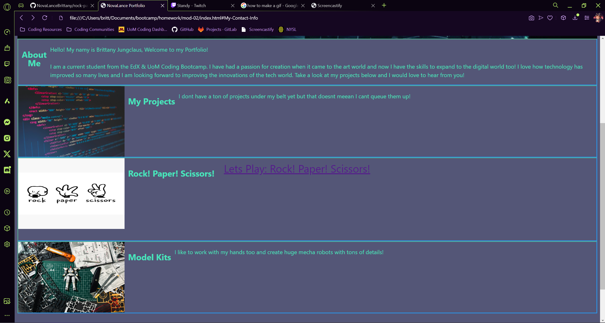

# Advanced CSS: Brittany Jungclaus Portfolio

## About Me: Brittany Jungclaus 


This is my first time building a Portfolio on the web! For now this will have sevaral placeholders for some of the projects that I have yet to complete as well as a section for live and completed projects that you can visit on the web. 

I am excited to show you my ideas and if you have any feedback please feel free to post comments on my GitHub page on this repo. 


## Tech Stack

```
Languages Featured: HTML, CSS, JS
```


## Portfolio Setup

Here are the critical requirements necessary to develop a portfolio that satisfies a typical hiring manager’s needs:

```
Items Needed: 
- name 
- recent photo or avatar
- links to sections about them
- examples of thier work
- how to contact them

- nav: the ui needs to go to the corresoponding piece
- examples of work: need to have titled images
  - the first app: needs to be larger then the other sections
-

- the images need to send the person to that applicated that is also deployed. (first HW maybe?)

- the page needs to be able to handle resizing of the window
- the page needs to be able to layed out in tablet, phone, and PC views

```


## Mock-Up

The following animation shows the web application's appearance:




## Other Devs & Teammates:

> **Professor & Assistants**: 

> * Prof. Gary Almes
> * TA. Kathryn Vincent


> **Teammates**: 
> * My entire course class. 
> * Note: I have not gotten permission to use thier names, I will update this list as needed. 


## Links

> * Repo: (https://github.com/NovaLanceBrittany/HW-02-Portfolio-)
> * GitHub Deplyment: [The URL]